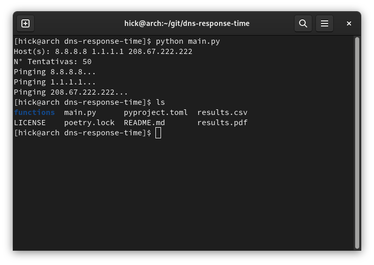
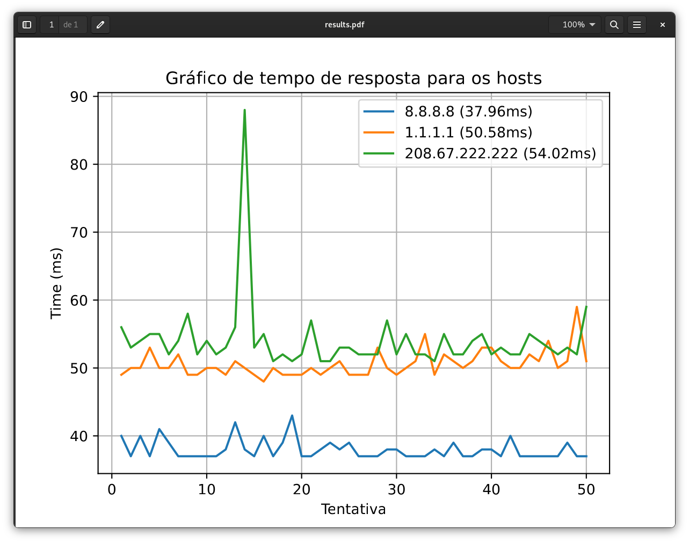

# DNS Response Time

Uma simples ferramenta para testar o tempo de resposta via ICMP ping para determinados servidores de DNS.

## Executando

Clone o projeto e instale as dependências:

```bash
git clone https://github.com/henriquesebastiao/dns-response-time.git
cd dns-response-time
poetry install
```

Execute o script:

```bash
python main.py
```

Será solicitado os servidores de DNS que deseja testar, basta informar os IPs separados por espaços. Por fim será solicitado a quantidade de pings que deseja realizar para cada servidor.

## Exemplo



Gráfico gerado:



